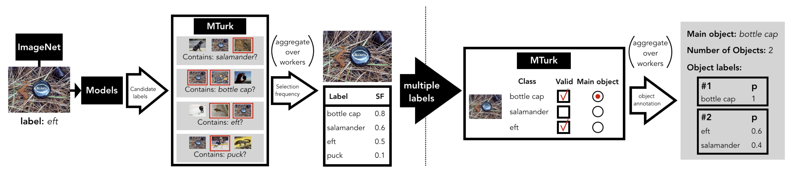

# Fine-grained annotations for the ImageNet validation set
This is the data collected for our paper "From ImageNet to Image Classification: Contextualizing Progress on Benchmarks" ([preprint](https://arxiv.org/abs/2005.11295), [blog](https://gradientscience.org/benchmarks)).



## Parsing the annotations
Our annotations are available as `pandas` dataframes in `data/annotations_{contains,classify}_task.pkl`. These dataframes included both the raw data collected (after quality control), as well as the aggregate quantities we computed for our analysis. The rest of the files in `data` contain auxiliary information.

The easiest way to navigate these files is by running the jupyter notebook (`basic_data_loading.ipynb`) which loads all files, providing an explanation for each field.

## Citation

```
@inproceedings{tsipras2020imagenet,
    title={From ImageNet to Image Classification: Contextualizing Progress on Benchmarks},
    author={Dimitris Tsipras and Shibani Santurkar and Logan Engstrom and Andrew Ilyas and Aleksander Madry},
    booktitle={ArXiv preprint arXiv:2005.11295},
    year={2020}
}
```

